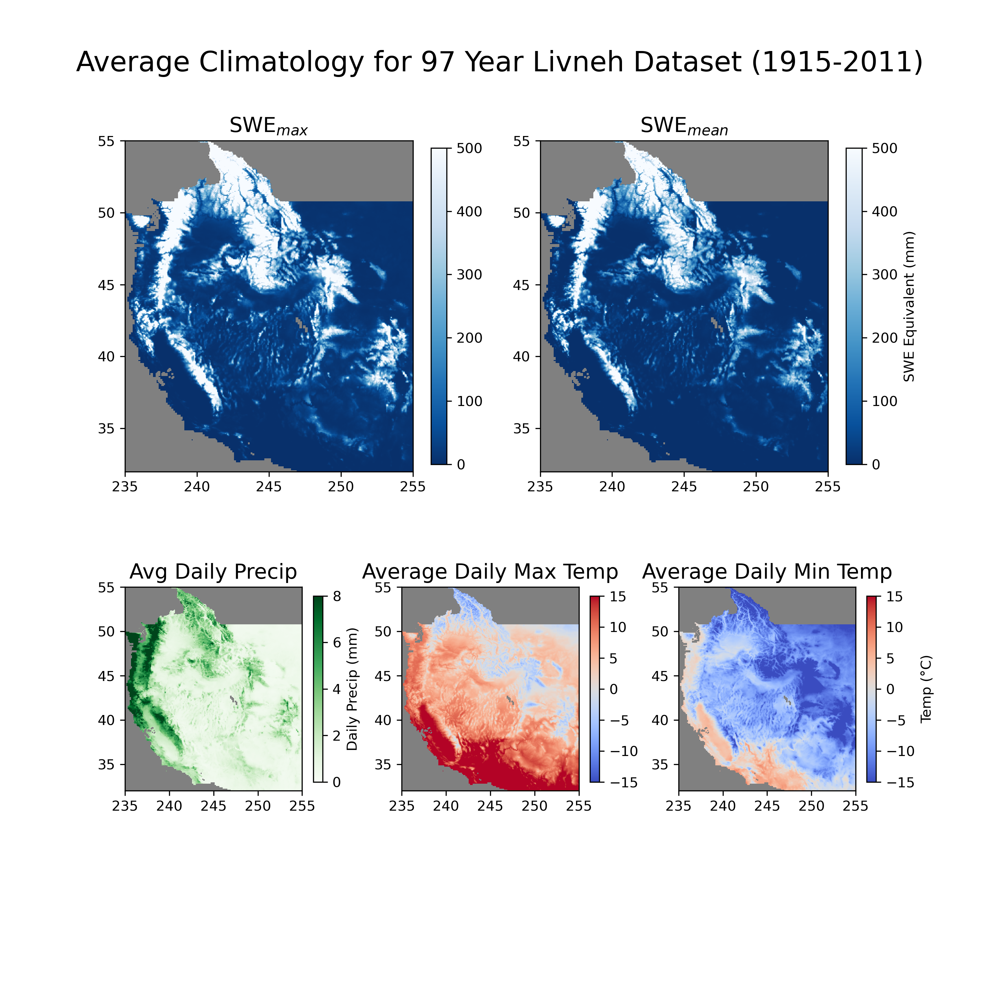

# Snow Droughts :snowflake: :cactus: :earth_americas: 

This project investigates the prevalence of snow droughts in the US West using the SPEAR_MED large ensemble at GFDL. We are looking to answer questions such as: What are the current trends in snow drought and extreme snow drought? What is the potential for year on year reoccurence of drought? Eg does having a snow drought in one year make it more likely for another to occur subsequently? 

## Climatology Review

I started this project by producing several climatology plots to summarize the average climatology of the West to get deviations from normal which can be used to get at characterizing snow droughts. 

<!--  -->

## Contributing
   
This project is funded by NOAA as part of their Hollings Program. I am working under supervision of Boulder/PSL's Mimi Hughes, and Princeton/GFDL's Nathaniel Johnson and Kai-Chih Tseng. If you are interested in the project and want to make a suggestion or have found a bug please feel free to open an issue! 