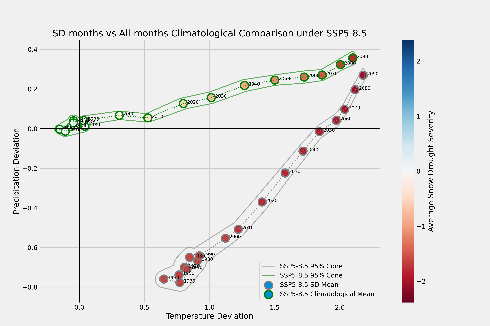

# Snow Droughts :snowflake: :cactus: :earth_americas: 

This project investigates the prevalence of snow droughts in the US West using the SPEAR_MED large ensemble at GFDL. We are looking to answer questions such as: What are the current trends in snow drought and extreme snow drought? What is the potential for year on year reoccurence of drought? Eg does having a snow drought in one year make it more likely for another to occur subsequently? 

## Climatology Review

I started this project by producing several climatology plots to summarize the average climatology of the West to get deviations from normal which can be used to get at characterizing snow droughts. 

# Analysis of Snow Drought trends into the 21st Century
Much of the project was done in jupyter notebooks as it's an easy interface to use via SSH to GFDL servers and I enjoy the REPL/Plotting combination. The notebooks in this folder contain the historical validation analysis and exploration of future trends. 
## Computation
[`Computes Ensemble Drought`](notebooks/Computes_Ensemble_Drought.ipynb) contains codes which replicate the z-score computation done in [`process_ens.py`](src/process_ens.py) but at scale for all 30 ensemble members for snowfall, precipitation, and temperature for both historical and future scenarios. We use embarasslingly parallel computing to run for all 30 ensemble members. This cut our total compute time from ~4 hours to 16 minutes!

## Results

### Historical 
We analyzed the historical severe drought (SSD) trends in [`Analyzes Historical SSD`](notebooks/Analyzes_Historical_SSD.ipynb) in order to validate the SPEAR-MED ensemble using a comparison to the Livneh dataset. Leveraging the 30 ensemble member gave us a distribution for these results. The example image below is the distribution of historical changes over the early to late historical for drought

### Future Snow Drought Predictions
We did comparisons of SWE levels in the 21st Century compared with levels in the historical period in [`Plots SSD Trends by Decade`](notebooks/Plots_SSD_Trends_by_Decade.ipynb). For a particular month of the year, e.g. March 2050, what was the average historical frequency of droughts as extreme, e.g. 10th percentile or z=-1.28? We aggregated by decade in order to smooth annual snowfall cycles by counting the number of drought months. The plot below depicts the percentage of winter months by decade which were classified as experiencing SSD.

In addition to overall snowfall trends, we were interested in temperature and preciptation climatologies, the aspects of the climate that will likely drive these changes. We found that the temperature was likely to contribute most significantly to the decreases in snowfall. These results can be found in [`Plots Climatological Trends`](notebooks/Plots_Climatological_Trends.ipynb).

In the works is a reoccurance analysis which seeks to answer questions like:
1. How likely is drought to re-occur year-on-year?
2. What months are likely to see the most effects? Is it shoulder seasons or will mid-winter also be hard hit?
These questions are actively being explored in [`Analyzes Drought Reoccurance`](notebooks/Analyzes_Drought_Reoccurrence.ipynb).

## Data Availability
Our code for this project can be found in the Snow Droughts repository (\url{https://github.com/Julians42/Snow_Droughts}) which is registered under doi: \texttt{10.5281/zenodo.7130302}. \\
\noindent\textbf{HUC2 Shapefiles}
The HUC2 shapefiles used to group data by HUC2 are available via FTP from NOAA's ESRL: You can access the shapefiles by connecting to: \texttt{ftp1.esrl.noaa.gov}, username: \texttt{anonymous}, your email address as password and port: 22. Files are titled \texttt{WBD\_\{XX\}\_HU2\_Shape.zip} for each region XX in 1-18. We ended up including these in our dataset - see doi: \texttt{10.5281/zenodo.7121527}.\\
\noindent\textbf{Livneh Dataset}
The livneh dataset is also available online via \url{https://psl.noaa.gov/data/gridded/data.livneh.html}, and can also be accessed via FTP at: \texttt{ftp2.psl.noaa.gov}, logging in with username \texttt{anonymous} and your email as the password and port 22 for public connection. \\
\noindent\textbf{SPEAR Data Online:}
SPEAR-MED data is partially available directly through GFDL's online server, found \url{https://www.gfdl.noaa.gov/spear_large_ensembles/} for the entire globe. The website provides the opportunity to download monthly mean historical temperature and precipitation data, alongside temperature and precipitation data under RCP5-8.5 by decade. 

\noindent\textbf{SPEAR Data via Zenodo:}
GFDL does not provide monthly snow data for either the historical or future simulated events, nor does it provide any data for RCP2-4.5, nor does it provide temperature maximum or minimum values which we use for analysis in the supplemental. Only 4/15 of the data we used was available directly from GFDL, and as it's filed by decade across the whole globe, it would require roughly a 120 GB download. We decided to crop all this data to make our work more easily reproducible, which is available under doi: \texttt{10.5281/zenodo.7121527}.

## Contributing
   
This project is funded by NOAA as part of their Hollings Program. I am working under supervision of Boulder/PSL's Mimi Hughes, and Princeton/GFDL's Nathaniel Johnson and Kai-Chih Tseng. If you are interested in the project and want to make a suggestion or have found a bug please feel free to open an issue! 