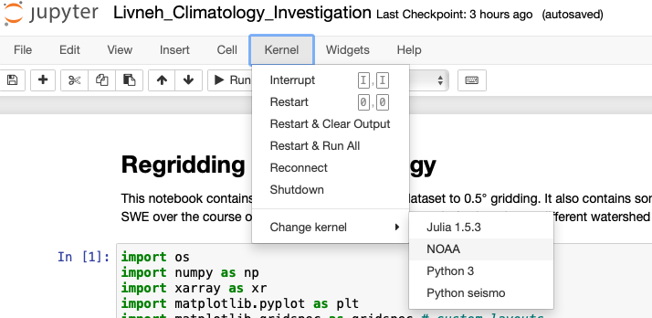

# Conda and Jupyter
## Jupyter Notebook Tricks

The trick with jupyter is that even though you've launched a notebook in a new conda env it might not launch the notebook with the correct kernel, meaning that it defaults to loading only packages in a different environment. To get around this we want to use the `jupyter` package. There are a few commands which are helpful:

### Hepful Code 
Credit mostly from [here](https://queirozf.com/entries/jupyter-kernels-how-to-add-change-remove)
```
$ source activate <py38>                              // activates environment - I'm using python 3.8
$ pip install jupyter                                 // To install
$ ipython kernel install --name "<NOAA>" --user       // add python kernel 
$ jupyter kernelspec list                             // list kernels 
$ jupyter kernelspec remove <old_kernel>              // remove old environment 
```
Then from your notebook you can change kernel by going to kernel &rightarrow; change kernel &rightarrow; noaa


### Verify 
We can check that we've activated the correct environment in both python in terminal and from the notebook:
```python
import sys
sys.path
```
