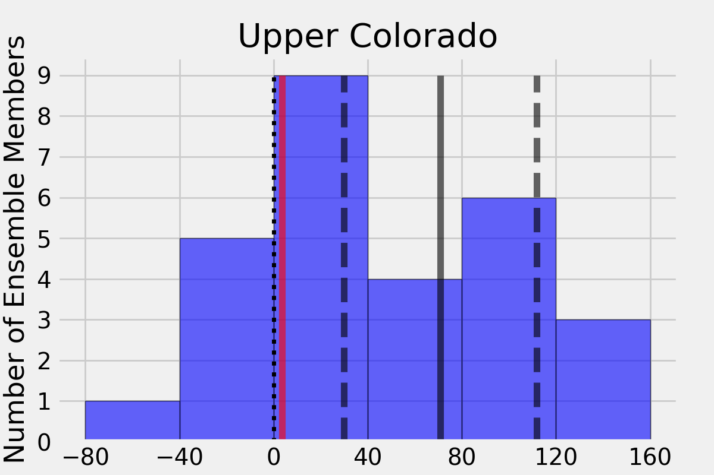
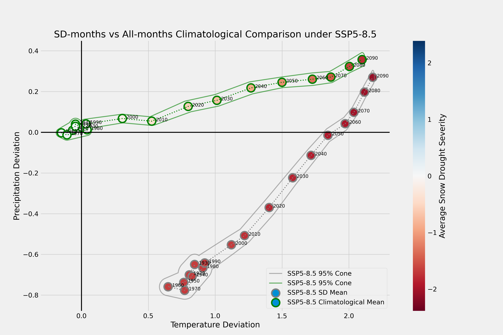

# Analysis of Snow Drought trends into the 21st Century
Much of the project was done in jupyter notebooks as it's an easy interface to use via SSH to GFDL servers and I enjoy the REPL/Plotting combination. The notebooks in this folder contain the historical validation analysis and exploration of future trends. 
## Computation
[`Computes Ensemble Drought`](Computes_Ensemble_Drought.ipynb) contains codes which replicate the z-score computation done in [`process_ens.py`](../src/process_ens.py) but at scale for all 30 ensemble members for snowfall, precipitation, and temperature for both historical and future scenarios. We use embarasslingly parallel computing to run for all 30 ensemble members. This cut our total compute time from ~4 hours to 16 minutes!

## Results

### Historical 
We analyzed the historical severe drought (SSD) trends in [`Analyzes Historical SSD`](Analyzes_Historical_SSD.ipynb) in order to validate the SPEAR-MED ensemble using a comparison to the Livneh dataset. Leveraging the 30 ensemble member gave us a distribution for these results. The example image below is the distribution of historical changes over the early to late historical for drought

### Future Snow Drought Predictions
We did comparisons of SWE levels in the 21st Century compared with levels in the historical period in [`Plots SSD Trends by Decade`](Plots_SSD_Trends_by_Decade.ipynb). For a particular month of the year, e.g. March 2050, what was the average historical frequency of droughts as extreme, e.g. 10th percentile or z=-1.28? We aggregated by decade in order to smooth annual snowfall cycles by counting the number of drought months. The plot below depicts the percentage of winter months by decade which were classified as experiencing SSD.

In addition to overall snowfall trends, we were interested in temperature and preciptation climatologies, the aspects of the climate that will likely drive these changes. We found that the temperature was likely to contribute most significantly to the decreases in snowfall. These results can be found in [`Plots Climatological Trends`](Plots_Climatological_Trends.ipynb).

In the works is a reoccurance analysis which seeks to answer questions like:
1. How likely is drought to re-occur year-on-year?
2. What months are likely to see the most effects? Is it shoulder seasons or will mid-winter also be hard hit?
These questions are actively being explored in [`Analyzes Drought Reoccurance`](Analyzes_Drought_Reoccurrence.ipynb).

